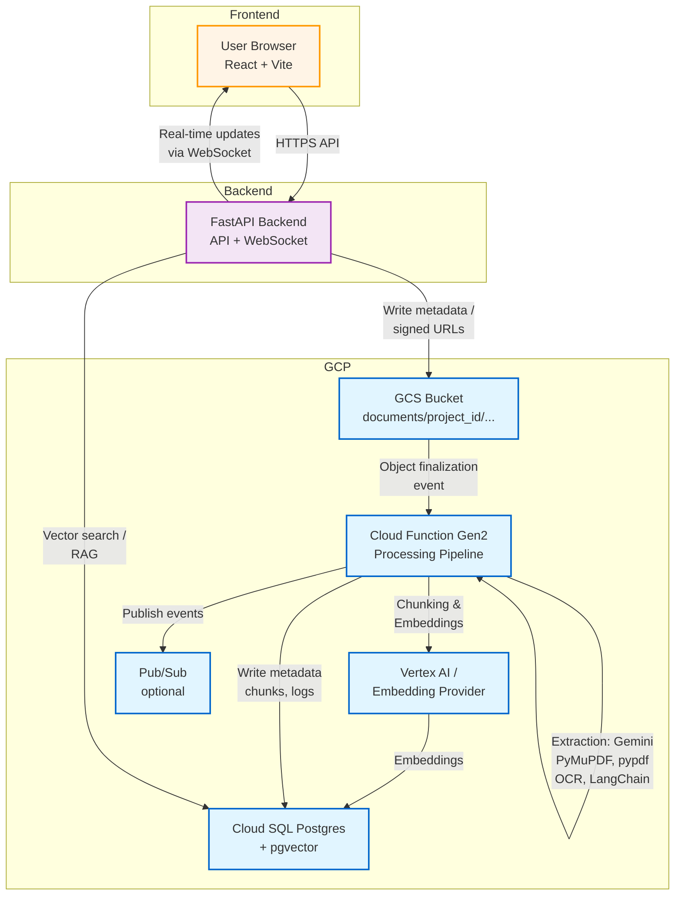

## DIVE Architecture (Mermaid)

This file contains a high-level architecture diagram for the DIVE platform. The diagram is written in Mermaid so it can be rendered in many Markdown viewers and GitHub.

### Notes

- The Cloud Function contains `pipeline_processor.py` which orchestrates extraction, chunking, embedding and writing to the DB. Gemini is integrated as a high-quality extractor when configured, but the pipeline uses local processors as fallbacks for resiliency and cost control.
- The backend (FastAPI) serves the API, user auth/authorization, and RAG orchestration. It queries `document_vectors` (pgvector) for similarity searches and composes prompts for the LLMs.
- Pub/Sub is optional and used when you need decoupled notifications or fan-out processing.

For more details see the component READMEs in the repository.
